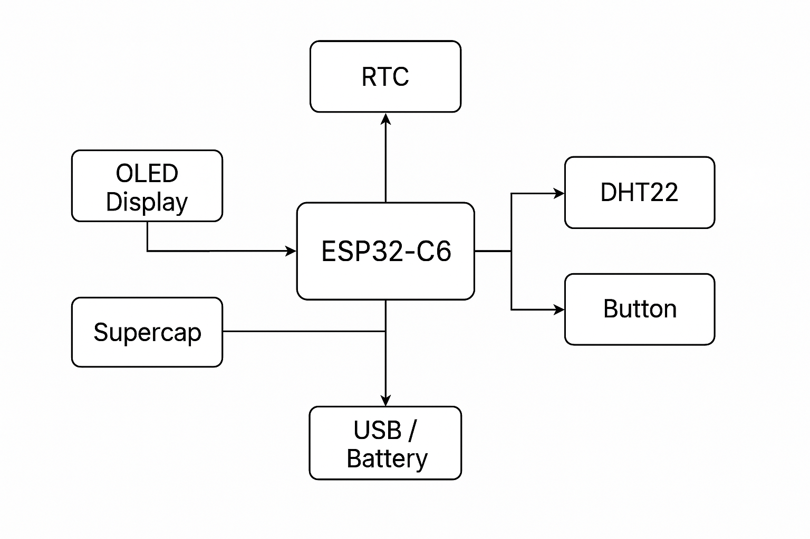

# TSC - Project

## Diagrama bloc
Diagrama bloc a proiectului nostru prezintă conexiunile dintre senzorii folosiți, microcontrollerul ESP32-C6 și componentele auxiliare:

 <!-- imaginea se pune în folderul proiectului -->

## BOM (Bill Of Materials)

| Componentă             | Cod produs                        | Link cumpărare                                              | Datasheet                                                                 |
|------------------------|-----------------------------------|--------------------------------------------------------------|---------------------------------------------------------------------------|
| ESP32-C6 DevKit        | ESP32-C6-DevKitC-1                | [Mouser](https://www.mouser.com/ProductDetail/356-ESP32C6DVK) | [Datasheet](https://www.espressif.com/sites/default/files/documentation/esp32-c6_datasheet_en.pdf) |
| Senzor de temperatură  | DHT22                             | [Comet](https://www.comet.ro/senzor-temperatura-umiditate-dht22) | [Datasheet](https://cdn.sparkfun.com/datasheets/Sensors/Temperature/DHT22.pdf) |
| Display OLED 0.96"     | SSD1306                           | [Mouser](https://www.mouser.com/ProductDetail/785-SSD1306MOD) | [Datasheet](https://cdn-shop.adafruit.com/datasheets/SSD1306.pdf) |
| Rezistor 10kΩ          | MF25 10K                          | [Comet](https://www.comet.ro/rezistor-10k-ohm-025w)            | [Datasheet](https://media.digikey.com/pdf/Data%20Sheets/Yageo%20PDFs/MF25_Spec.pdf) |
| Buton push             | PBS-110                           | [Comet](https://www.comet.ro/buton-micro-6x6mm)                | [Datasheet](https://www.omron.com/ecb/products/pdf/en-b3f.pdf) |

| Component | Link Cumpărare | Datasheet |
|-----------|----------------|-----------|
| BOOT_BUTTON | [Link](https://www.snapeda.com/parts/EVQP7L01P/Panasonic/view-part/?welcome=home&ref=search&t=evqp7l01p) | [PDF](https://industry.panasonic.com/global/en/downloads?tab=catalog&small_g_cd=203&part_no=EVQPUJ02K) |
| C1 | [Link](https://componentsearchengine.com/part-view/CC0402MRX5R5BB106/YAGEO) | [PDF](https://componentsearchengine.com/Datasheets/2/CC0402MRX5R5BB106.pdf) |
| C1_BAT | [Link](https://componentsearchengine.com/part-view/CC0402MRX5R5BB106/YAGEO) | [PDF](https://componentsearchengine.com/Datasheets/2/CC0402MRX5R5BB106.pdf) |
| C1_BAT1 | [Link](https://www.snapeda.com/parts/CC0402DRNPO9BN5R1/Yageo/view-part/?ref=dk&t=LTSPICE_CC0402&con_ref=None) | [PDF](https://s3.amazonaws.com/snapeda/datasheet/CC0402DRNPO9BN5R1_Yageo.pdf) |
| C2_BAT1 | [Link](https://www.snapeda.com/parts/CC0402DRNPO9BN5R1/Yageo/view-part/?ref=dk&t=LTSPICE_CC0402&con_ref=None) | [PDF](https://s3.amazonaws.com/snapeda/datasheet/CC0402DRNPO9BN5R1_Yageo.pdf) |
| C1_BAT2 | [Link](https://www.snapeda.com/parts/CC0402DRNPO9BN5R1/Yageo/view-part/?ref=dk&t=LTSPICE_CC0402&con_ref=None) | [PDF](https://s3.amazonaws.com/snapeda/datasheet/CC0402DRNPO9BN5R1_Yageo.pdf) |
| C2 | [Link](https://componentsearchengine.com/part-view/CC0402MRX5R5BB106/YAGEO) | [PDF](https://componentsearchengine.com/Datasheets/2/CC0402MRX5R5BB106.pdf) |
| C2_BAT | [Link](https://componentsearchengine.com/part-view/CC0402MRX5R5BB106/YAGEO) | [PDF](https://componentsearchengine.com/Datasheets/2/CC0402MRX5R5BB106.pdf) |
| C3 | [Link](https://componentsearchengine.com/part-view/T491B107M006AT/KEMET) | [PDF](https://s3.amazonaws.com/snapeda/datasheet/TAJB475K025RNJ_AVX.pdf) |
| C4 | [Link](https://componentsearchengine.com/part-view/CC0402MRX5R5BB106/YAGEO) | [PDF](https://componentsearchengine.com/Datasheets/2/CC0402MRX5R5BB106.pdf) |
| C4_USB | [Link](https://componentsearchengine.com/part-view/CC0402MRX5R5BB106/YAGEO) | [PDF](https://componentsearchengine.com/Datasheets/2/CC0402MRX5R5BB106.pdf) |
| C5 | [Link](https://componentsearchengine.com/part-view/CC0402MRX5R5BB106/YAGEO) | [PDF](https://componentsearchengine.com/Datasheets/2/CC0402MRX5R5BB106.pdf) |
| C5_USB | [Link](https://componentsearchengine.com/part-view/CC0402MRX5R5BB106/YAGEO) | [PDF](https://componentsearchengine.com/Datasheets/2/CC0402MRX5R5BB106.pdf) |
| C6 | [Link](https://componentsearchengine.com/part-view/CC0402MRX5R5BB106/YAGEO) | [PDF](https://componentsearchengine.com/Datasheets/2/CC0402MRX5R5BB106.pdf) |
| C7 | [Link](https://componentsearchengine.com/part-view/CC0402MRX5R5BB106/YAGEO) | [PDF](https://componentsearchengine.com/Datasheets/2/CC0402MRX5R5BB106.pdf) |
| C8 | [Link](https://componentsearchengine.com/part-view/CC0402MRX5R5BB106/YAGEO) | [PDF](https://componentsearchengine.com/Datasheets/2/CC0402MRX5R5BB106.pdf) |
| C9 | [Link](https://www.snapeda.com/parts/CC0402DRNPO9BN5R1/Yageo/view-part/?ref=dk&t=LTSPICE_CC0402&con_ref=None) | [PDF](https://s3.amazonaws.com/snapeda/datasheet/CC0402DRNPO9BN5R1_Yageo.pdf) |
| C10 | [Link](https://componentsearchengine.com/part-view/CC0402MRX5R5BB106/YAGEO) | [PDF](https://componentsearchengine.com/Datasheets/2/CC0402MRX5R5BB106.pdf) |
| C10_SUPERCAP | [Link](https://www.snapeda.com/parts/CPH3225A/Seiko+Instruments/view-part/?ref=eda) | [PDF](https://www.snapeda.com/parts/CPH3225A/Seiko%20Instruments/datasheet/) |

## ⚙️ Descriere hardware

Acest proiect utilizează un microcontroller **ESP32-C6** pentru gestionarea unui sistem de afișare și citire senzorială:

- **DHT22** transmite date despre temperatură și umiditate către ESP32-C6 prin pinul digital.
- **Display-ul OLED SSD1306** este conectat pe magistrala I2C pentru a afișa datele în timp real.
- **Butonul push** este utilizat pentru resetarea valorilor sau declanșarea anumitor moduri.
- Sistemul este alimentat prin USB 5V, iar consumul total este estimat la ~120mA.

## Pini utilizați pe ESP32-C6

| Componentă             | Pin ESP32-C6 | Motiv utilizare           |
|------------------------|--------------|----------------------------|
| DHT22                  | GPIO4        | Intrare digitală de la senzor |
| OLED SSD1306 (SCL)     | GPIO8        | Comunicație I2C - clock     |
| OLED SSD1306 (SDA)     | GPIO9        | Comunicație I2C - date      |
| Buton push             | GPIO3        | Input digital               |

## Alte observații

- Design-ul PCB a fost realizat în Fusion 360 PCB și randarea este disponibilă în fișierul `rendering.png`.
- Componentele au fost amplasate compact, ținând cont de răcire și accesibilitate.
- Codul sursă este scris în C++ folosind framework-ul Arduino pentru ESP32-C6.

---

Dacă ai deja randările sau bloc-diagrama, înlocuiești `[Block Diagram](./block-diagram.png)` cu path-ul corect către imagine. Pot să te ajut și să desenez una pentru tine dacă îmi dai ce module ai folosit.

Vrei să-ți transform acest conținut direct în fișierul `README.md` ca să-l copiezi ușor în proiect?
